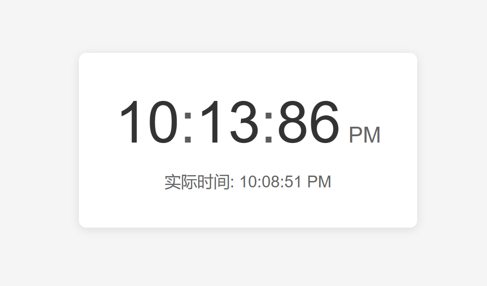

# 🕰️ 百进制时钟

**时间，本该如此简单。**  
一款将每日划分为100"百分日"（1百分日=14.4分钟）的十进制时钟，用更符合直觉的方式重新定义时间计量。

 *(请替换实际截图)*

---

## ✨ 核心特性
- **百分制显示**：全天范围 `1.00`~`100.00`（例：`50.00`=正午）
- **双模式切换**：支持百分制与传统24小时制即时转换
- **精密计时**：精确至0.01百分日（约8.64秒）
- **跨平台运行**：适配桌面/移动端（请注明具体平台）
- **深度定制**：开放颜色、字体等样式修改（如为开源项目）

---

## 🛠️ 安装指南

### 桌面端（示例）
```bash
git clone https://github.com/Justintunsday/HectoHorologe.git
cd base100-clock
npm install && npm start
